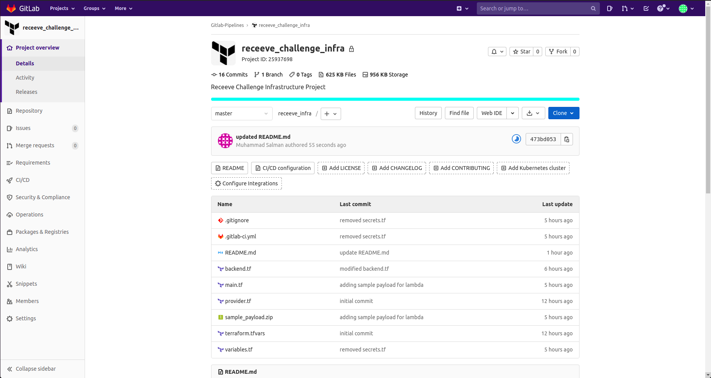

# GitLab Infra Project

To Setup GitLab CI/CD Project for the Infrastructure Provisioning through Terraform for Mailgun-Lambda-SNS

## Setup

Steps to be followed:

* First of all create a new GitLab Project with any name you want

* Goto the Settings, then CI/CD settings and expand the Variables section to add the following variables:
    - AWS_ACCESS_KEY_ID
    - AWS_SECRET_ACCESS_KEY
    - AWS_DEFAULT_REGION
    - ssm_webhook_signing_key (**HTTP webhook signing key from Mailgun Dashboard**)

* Now, clone the GitLab Infra Project repository and copy the code to new cloned repository or just initilize this repository as the GitLab Infra Project repository

* Finally, Commit and Push the code to the GitLab Infra Project repository

GitLab Pipeline will automatically trigger and deploy the Infrastructure. You can watch the different Stages of the Pipeline in CI/CD section of the Project. It will deploy the following AWS Services:

* AWS Lambda Function
* AWS API Gatewat
* AWS SSM
* AWS SNS
* AWS S3

The lambda function for now contains the sample hello world code, the lambda function code will be updated by the **GitLab Lambda Project**

## GitLab Infra Project Overview

